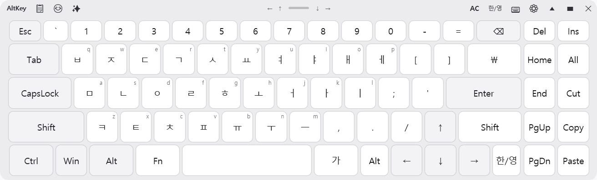

<div align="center">

# AltKey

**한국어 사용자 전용 커스터마이징 화상 키보드**

Windows 환경에서 한국어 입력을 최적화하여 지원하는 경량·무설치 가상 키보드. macOS 손쉬운 사용 키보드에서 영감을 받아 Windows 생태계와 한국어 입력 특성에 맞게 재설계되었습니다.

[](https://github.com/CrowKing63/AltKey/releases/latest)
[](LICENSE)
[](https://dotnet.microsoft.com)
[](https://www.microsoft.com/windows)

[설치](#설치) · [기능](#기능) · [스크린샷](#스크린샷) · [레이아웃 커스텀](#레이아웃-커스텀) · [매뉴얼](https://github.com/CrowKing63/AltKey/wiki)

</div>

---

## 개요

AltKey는 마우스, 터치 입력, 또는 외부 스위치만으로 물리적 키보드를 완전히 대체할 수 있는 화상 키보드입니다.
물리적 키보드가 없거나 특정 키 입력이 어려운 상황에서도 빠르고 유연한 텍스트 입력이 가능하도록 설계되었습니다.

### 핵심 철학

| | |
|---|---|
| **한국어 최적화** | 한국어 조합 엔진(`KoreanInputModule`) 내장, 전용 레이아웃 및 자동완성 지원 |
| **접근성 우선** | TTS, 스위치 스캔, 체류 클릭 등 다양한 보조 공학 도구 제공 |
| **포터블 & 경량** | 단일 실행 파일, 낮은 리소스 점유, 설치 불필요 |
| **커스터마이징** | JSON 기반 레이아웃 에디터, 앱별 레이아웃 프로필 자동 전환 |

---

## 기능

### 입력 및 조합
- **KoreanInputModule** — 유니코드 기반의 고성능 한글 조합 엔진을 통한 정밀한 입력 처리
- **QuietEnglish 서브모드** — 별도의 영어 레이아웃 없이 한국어 레이아웃 내 "가/A" 토글만으로 직관적인 영문 입력 지원
- **Sticky Keys** — 수식자 키(Shift·Ctrl·Alt·Win) 일회성 고정, 영구 잠금, 해제 기능 (한 번/두 번/세 번 탭)
- **직접 유니코드 입력** — 이모지, 특수 문자 등 모든 유니코드 문자의 직접 전송 지원

### 접근성 (Accessibility)
- **TTS (Text-to-Speech)** — 키 위에 마우스를 올리거나 초점이 이동할 때 키 이름을 음성으로 안내 (시각 보조)
- **체류 클릭 (Dwell Click)** — 클릭 없이 키 위에 머무르는 것만으로 자동 클릭 (운동 장애 사용자 지원)
- **스위치 스캔 (Switch Scan)** — 외부 스위치나 지정 키를 사용하여 키보드 항목을 순차적으로 탐색 및 선택
- **키보드 내비게이션** — 물리 키보드의 Tab/Enter/Space 등을 가상 키보드 조작에 연결

### 지능형 입력 보조
- **빈도·빅그램 기반 자동완성** — 사용자의 입력 습관과 문맥을 분석하여 단어 추천 및 다음 단어 예측
- **사용자 사전 편집** — 자주 쓰는 단어나 고유 명사를 사전에 등록하여 자동완성 제안 최적화
- **이모지 & 클립보드 패널** — 최근 복사한 텍스트 히스토리와 자주 쓰는 이모지에 즉시 접근 가능

### UX/UI 및 관리
- **Windows 11 Acrylic 블러** 효과 및 시스템 테마(다크/라이트) 자동 연동
- **자동 투명도 제어** — 미사용 시 반투명화되어 화면 가림을 최소화하고 시인성 확보
- **앱별 레이아웃 프로필** — 포그라운드 앱을 감지하여 해당 앱에 최적화된 레이아웃으로 자동 전환
- **화면 가장자리 정렬** — 상단 바의 버튼을 통해 키보드를 화면 사방 끝으로 즉시 이동

---

## 스크린샷



---

## 설치

### 설치 프로그램 (권장)
1. [latest release](https://github.com/CrowKing63/AltKey/releases/latest)에서 `AltKey-Setup-x.y.z.exe` 다운로드
2. 설치 프로그램 실행하여 가이드에 따라 설치

### 포터블 (Portable)
1. [latest release](https://github.com/CrowKing63/AltKey/releases/latest)에서 `AltKey-Portable-x.y.z.zip` 다운로드
2. 원하는 위치에 압축 해제 후 `AltKey.exe` 바로 실행 (설정은 같은 폴더에 저장됨)

---

## 레이아웃 커스텀

레이아웃은 `layouts/` 폴더의 JSON 파일로 정의되며, 내장된 **레이아웃 에디터**(설정 → 레이아웃 에디터)를 통해 GUI 환경에서 직관적으로 편집할 수 있습니다.

```jsonc
{
  "name": "나만의 레이아웃",
  "rows": [
    {
      "keys": [
        {
          "label": "📋",
          "action": { "type": "ClipboardPaste", "text": "자주 쓰는 문구" },
          "width": 2.0
        },
        {
          "label": "메모장",
          "action": { "type": "RunApp", "path": "notepad.exe" },
          "width": 2.0
        }
      ]
    }
  ]
}
```

- **`width`**: 표준 키 대비 상대적 너비
- **`label` / `shift_label`**: 기본 및 Shift 활성화 시 표시될 텍스트
- **`english_label` / `english_shift_label`**: "가/A" 토글(QuietEnglish 모드) 시 표시될 텍스트

---

## 프로젝트 구조

```text
AltKey/
├── App.xaml / .cs                  # 앱 진입점, DI 컨테이너 및 서비스 초기화
├── MainWindow.xaml / .cs           # 메인 윈도우 (Acrylic 블러, 투명도, NoActivate 처리)
│
├── Views/                          # XAML UI 구성 요소
│   ├── KeyboardView.xaml           # 키보드 레이아웃 및 키 버튼 렌더링
│   ├── SettingsWindow.xaml         # 전체 환경 설정 인터페이스
│   ├── LayoutEditorWindow.xaml     # 드래그 앤 드롭 지원 레이아웃 편집기
│   ├── EmojiPanel.xaml             # 이모지 선택 및 카테고리 패널
│   ├── ClipboardPanel.xaml         # 클립보드 히스토리 관리 및 붙여넣기
│   ├── SuggestionBar.xaml          # 자동완성 추천어 표시 바
│   ├── FocusA11ySettingsWindow.xaml # 포커스 탐색 및 시각 보조 설정
│   └── SwitchScanSettingsWindow.xaml # 외부 스위치 스캐닝 설정
│
├── Services/                       # 비즈니스 로직 및 코어 서비스
│   ├── InputService.cs             # SendInput API 호출 및 액션 실행 총괄
│   ├── InputLanguage/
│   │   ├── KoreanInputModule.cs    # 핵심 한글 자모 조합 로직 (State Machine)
│   │   ├── JamoNameResolver.cs     # 자모 음성 안내를 위한 이름 매핑 (TTS용)
│   │   └── InputSubmode.cs         # QuietEnglish 등 입력 보조 모드 정의
│   ├── AccessibilityService.cs     # TTS(음성 출력) 관리
│   ├── AccessibilityNavigationService.cs # 스캔 및 키보드 탐색 제어
│   ├── AutoCompleteService.cs      # 단어 추천 및 빈도 분석 로직
│   ├── LayoutService.cs            # JSON 레이아웃 직렬화 및 프로필 관리
│   ├── ProfileService.cs           # 활성 창 감지 및 레이아웃 자동 전환
│   ├── ClipboardService.cs         # 시스템 클립보드 모니터링 및 기록
│   └── ...                         # 기타 (Tray, Theme, Hotkey, Update 등)
│
├── ViewModels/                     # MVVM 패턴 기반의 데이터 바인딩 로직
├── Models/                         # 데이터 구조체 (Layout, Config, KeyAction 등)
├── Controls/                       # 커스텀 컨트롤 (KeyButton, NumericAdjuster)
├── Platform/                       # Win32 P/Invoke API 선언 (User32, Shell32)
└── layouts/                        # 기본 제공 및 사용자 커스텀 레이아웃 파일
```

---

## 기술 스택

| 분류 | 기술 |
|---|---|
| **언어 및 런타임** | C# 12, .NET 8 (Self-contained) |
| **UI 프레임워크** | WPF (Windows Presentation Foundation) |
| **디자인 시스템** | WPF-UI (Acrylic 효과 및 Modern 스타일) |
| **아키텍처** | MVVM (CommunityToolkit.Mvvm) |
| **입력 기술** | Win32 SendInput, Low-level Keyboard Hooks |

---

## 라이선스

[MIT License](LICENSE) © 2025-2026 CrowKing63