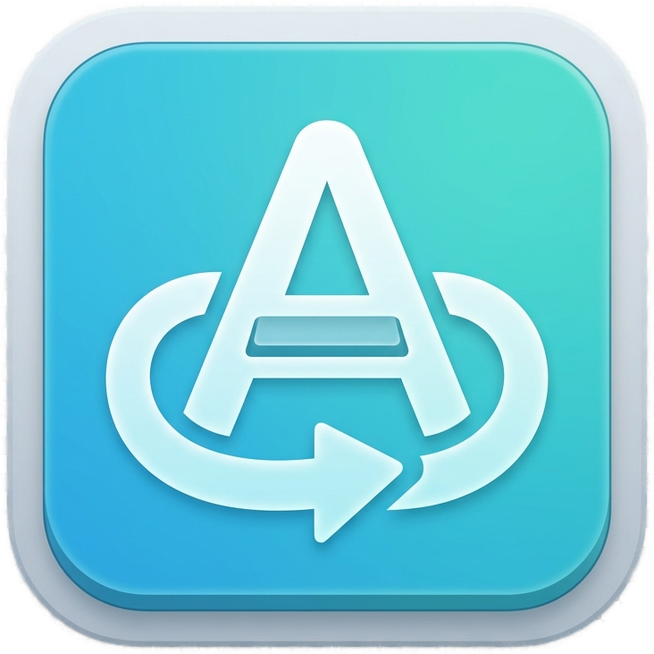

<div align="center">



# AltKey

**한국어 사용자 전용 커스터마이징 화상 키보드**

Windows 환경에서 한국어 입력을 최적화하여 지원하는 경량 화상 키보드입니다. macOS 손쉬운 사용 키보드에서 영감을 받아 Windows 생태계와 한국어 입력 특성, 그리고 접근성 요구에 맞게 다시 설계했습니다.

[](https://github.com/CrowKing63/AltKey/releases/latest)
[](LICENSE)
[](https://dotnet.microsoft.com)
[](https://www.microsoft.com/windows)

[설치](#설치) · [기능](#기능) · [최근 반영](#최근-반영) · [커스터마이징](#커스터마이징) · [매뉴얼](https://github.com/CrowKing63/AltKey/wiki)

</div>

---

## 개요

AltKey는 마우스, 터치, 외부 스위치만으로도 물리 키보드를 대체할 수 있도록 만든 화상 키보드입니다. 한국어 조합 엔진을 앱 내부에 직접 포함하고 있어, 윈도우 한/영 상태가 흔들리기 쉬운 환경에서도 더 안정적으로 입력할 수 있습니다. 일반 키 입력은 물리 키보드에 가까운 방식으로 보내, 게임이나 특수 앱에서도 더 자연스럽게 동작하도록 개선했습니다.

### 핵심 철학

| | |
|---|---|
| **한국어 최적화** | `KoreanInputModule` 기반 한글 조합, QuietEnglish(`가/A`) 서브모드, 한국어 중심 자동완성 |
| **접근성 우선** | TTS, 체류 클릭, 스위치 스캔, Sticky Keys, 키보드 탐색 기능 제공 |
| **실사용 중심** | 자동완성, 상용구, 앱별 레이아웃, 클립보드/이모지 패널로 실제 입력 부담 감소 |
| **안전한 커스터마이징** | 레이아웃/사전/프로필/AI 프롬프트를 독립 편집 도구에서 수정하고 즉시 반영 |

---

## 최근 반영

- **물리 키보드에 가까운 키 입력**: 일반 키와 길게 누르기 동작을 실제 키보드처럼 보내 게임·특수 앱 호환성을 높였습니다.
- **홀드 입력 제스처 (`v0.9.5`)**: 키를 누른 채 유지하면 물리 키보드처럼 `KeyDown` 상태를 계속 유지하고, 마우스를 떼거나 버튼 밖으로 벗어나면 안전하게 `KeyUp`을 보냅니다.
- **홀드 입력 안전 해제 강화 (`v0.9.5`)**: 창 숨김·종료·마우스 캡처 손실 같은 경로에서도 눌린 키가 남지 않도록 정리 흐름을 보강했습니다.
- **상단바 단축키 한도 검증 (`v0.9.6`)**: 커스텀 상단바 단축키는 최대 10개까지 만들 수 있고, 한쪽에 버튼이 과하게 몰리면 저장 전에 안내하고 조정하도록 바뀌었습니다.
- **상단바 더블 클릭 접기/펼치기 (`v0.9.8`)**: 상단바의 빈 영역이나 가운데 드래그 핸들을 더블 클릭해 키보드를 바로 접거나 다시 펼칠 수 있습니다.
- **드래그와 더블 클릭 충돌 방지 (`v0.9.8`)**: 드래그 핸들은 일정 거리 이상 움직였을 때만 창 이동을 시작해, 더블 클릭 접기 동작과 겹치지 않도록 조정했습니다.
- **RunApp / ShellCommand 인수 보존 개선 (`v0.9.7`)**: 경로 공백, 따옴표, PowerShell·CMD 명령 본문을 AltKey가 임의로 다시 감싸지 않고 입력한 그대로 전달하도록 안정성을 높였습니다.

---

## 기능

### 입력 및 조합

- **KoreanInputModule**: 유니코드 기반 한글 조합 엔진으로 정확한 입력 처리
- **QuietEnglish 서브모드**: 별도 영어 레이아웃 없이 한국어 레이아웃 안에서 `가/A` 토글로 영문 입력
- **Sticky Keys**: Shift·Ctrl·Alt·Win을 일회성 고정 또는 잠금 상태로 사용
- **직접 유니코드 입력**: 이모지, 특수문자, 상용구도 안정적으로 입력

### 접근성

- **TTS**: 키 이름과 상태를 음성으로 안내
- **체류 클릭**: 클릭 없이 커서를 머무르게 해 자동 입력
- **스위치 스캔**: 외부 스위치나 지정 키로 순차 탐색
- **키보드 내비게이션**: Tab/Enter/Space 등으로 가상 키보드 조작

### 지능형 입력 보조

- **빈도·빅그램 기반 자동완성**: 자주 쓰는 단어와 다음 단어 문맥을 학습
- **사용자 단어 편집기**: 학습된 단어를 직접 보고 정리
- **AI 텍스트 처리**: 선택 텍스트를 요약·정리·변환하는 AI 기능
- **이모지 & 클립보드 패널**: 반복 입력을 줄이는 빠른 패널

### UX/UI 및 관리

- **홀드 입력**: 길게 누르면 실제 키를 누르고 있는 상태를 유지하고, 놓거나 버튼 밖으로 벗어나면 즉시 해제
- **Fn 레이어 표시와 상태 순환**: `Fn` 키를 한 번 누르면 1회 적용, 두 번 누르면 고정 상태로 순환
- **동적 행 높이**: 행 단위 높이 조절로 더 큰 터치 목표와 더 촘촘한 보조열을 상황에 맞게 구성
- **전체 키 소프트 강조**: 문자 키를 포함한 모든 키에 살짝 강조 톤을 적용해 시인성 향상
- **상단바 버튼 사용자화**: 자주 쓰는 도구 버튼만 남기고 순서 재배치, 커스텀 단축키 최대 개수와 표시 한도 검증 지원
- **상단바 더블 클릭 접기/펼치기**: 빈 공간이나 드래그 핸들을 더블 클릭해 빠르게 접고 펼치기
- **앱별 레이아웃 프로필**: 포그라운드 앱에 따라 레이아웃 자동 전환
- **독립 편집 도구(AltKey.Tools)**: 편집 작업을 메인 입력 창과 분리해 안정성 확보
- **따옴표 보존 실행 인수 처리**: `RunApp`, `ShellCommand` 액션에서 사용자가 입력한 명령 문자열을 그대로 전달
- **자동 투명도 / 화면 가장자리 정렬** 지원

---

## 스크린샷

<p align="center">
  
  <br>
  <em>Basic Plus 레이아웃</em>
</p>

---

## 설치

### 설치 프로그램 (권장)

1. [latest release](https://github.com/CrowKing63/AltKey/releases/latest)에서 `AltKey-Setup-x.y.z.exe` 다운로드
2. 설치 프로그램을 실행해 안내에 따라 설치
3. 설치 버전에는 메인 앱과 함께 **`AltKey.Tools` 편집 도구**도 포함됩니다

### 포터블 (Portable)

1. [latest release](https://github.com/CrowKing63/AltKey/releases/latest)에서 `AltKey-Portable-x.y.z.zip` 다운로드
2. 원하는 위치에 압축 해제
3. `AltKey.exe`를 실행하면 같은 폴더 구조 안의 `Tools` 하위 편집 도구를 함께 사용할 수 있습니다

---

## 커스터마이징

### 독립 편집 도구

설정 창에서 다음 편집기를 각각 열 수 있습니다.

- **레이아웃 편집기**: 키 배치와 액션 수정
- **사용자 단어 편집기**: 자동완성 학습 단어 확인·정리
- **프로필 매핑 편집기**: 앱별 레이아웃 자동 전환 규칙 편집
- **AI 프롬프트 편집기**: 긴 한글 프롬프트를 별도 창에서 안정적으로 수정
- **상단바 단축키 편집기**: 커스텀 상단바 버튼의 아이콘, 툴팁, 접근성 이름, 실행 액션을 편집하고 저장 전 개수·배치 한도를 검사

편집기에서 저장하면 메인 앱이 재시작 없이 다시 읽어 반영하도록 설계되어 있습니다.

### 레이아웃 편집에서 새로 다룰 수 있는 것

- **Fn 액션과 Fn 라벨**: 일반 입력과 별개로 `Fn` 상태에서 실행할 동작과 표시 라벨을 지정할 수 있습니다.
- **행 높이 프리셋**: 각 행을 `기본` 또는 `낮음`으로 맞춰 숫자줄, 기능줄, 보조줄을 더 효율적으로 배치할 수 있습니다.
- **소프트 액센트 강조**: 어떤 키든 살짝 강조된 톤으로 표시해 시각적 식별을 돕습니다.

### 레이아웃 예시

레이아웃은 `layouts/` 폴더의 JSON 파일로 정의됩니다.

```jsonc
{
  "name": "나만의 레이아웃",
  "columns": [
    {
      "rows": [
        {
          "keys": [
            {
              "label": "📋 상용구",
              "action": { "type": "ClipboardPaste", "text": "자주 쓰는 문구" },
              "width": 2.0
            },
            {
              "label": "AI 요약",
              "action": { "type": "Ai", "prompt": "다음 문장을 짧고 공손한 한국어로 정리해줘." },
              "width": 2.0
            }
          ]
        }
      ]
    }
  ]
}
```

- **`width`**: 표준 키 대비 상대 너비
- **`label` / `shift_label`**: 기본 및 Shift 표시 텍스트
- **`english_label` / `english_shift_label`**: QuietEnglish 모드에서 보일 텍스트

---

## 프로젝트 구조

```text
AltKey/
├── AltKey/                          # 메인 앱
│   ├── App.xaml / .cs               # 앱 진입점, DI 및 서비스 초기화
│   ├── MainWindow.xaml / .cs        # 메인 윈도우와 런타임 제어
│   ├── Views/                       # 키보드, 설정, 패널 UI
│   ├── ViewModels/                  # MVVM 바인딩 로직
│   ├── Models/                      # AppConfig, Layout, KeyAction 등
│   ├── Services/
│   │   ├── InputLanguage/           # KoreanInputModule, InputSubmode
│   │   ├── AutoCompleteService.cs   # 자동완성 및 문맥 제안
│   │   ├── ToolsReloadSignalService.cs # AltKey.Tools와의 재로드 신호
│   │   ├── LayoutRepository.cs      # 레이아웃 저장소 경계
│   │   └── UserDictionaryRepository.cs # 사용자 사전 저장소 경계
│   └── Controls/                    # KeyButton, NumericAdjuster
├── AltKey.Tools/                    # 독립 편집 도구 앱
│   ├── MainWindow.xaml / .cs        # 도구 시작 화면 및 직접 진입 인자 처리
│   ├── ProfileMappingEditorWindow.* # 프로필 매핑 편집기
│   ├── AiPromptEditorWindow.*       # AI 프롬프트 편집기
│   └── HeaderShortcutEditorWindow.* # 상단바 단축키 편집기
├── Wiki/AltKey.wiki/                # 사용자용 매뉴얼
├── docs/altkey-tools/               # 도구 분리 설계/유지보수 문서
└── layouts/                         # 기본 및 사용자 레이아웃
```

---

## 기술 스택

| 분류 | 기술 |
|---|---|
| **언어 및 런타임** | C# 12, .NET 8 |
| **UI 프레임워크** | WPF |
| **아키텍처** | MVVM (CommunityToolkit.Mvvm) |
| **입력 기술** | Win32 SendInput, Low-level Keyboard Hooks |
| **보안 저장** | Windows DPAPI |

---

## 라이선스

[MIT License](LICENSE) © 2026 CrowKing63
