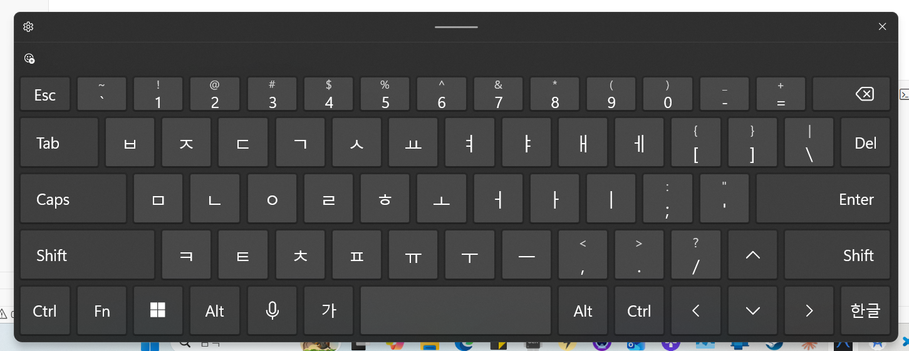

# 자동완성 통합 리팩터링 — 2026-04-16

> **브랜치**: `feature/unified-autocomplete`
> **상태**: 1차 구현 완료, 빌드 성공, 구조적 한계 논의 필요
> **참조**: `feature-korean-autocomplete.md`, `ime-korean-detection-problem.md`

---

## 1. 변경 배경

기존 `AutoCompleteService.IsKoreanMode`는 `MainViewModel`에서 `layout.Language == "ko"`로 설정하는 부울 프로퍼티였다. 이 방식은:

- **하드코딩**: "ko"만 한국어로 인식, 다른 언어 추가 불가
- **레이아웃과 강결합**: 레이아웃 JSON에 `language` 필드가 있어야 작동
- **커스텀 레이아웃 배제**: 사용자가 만든 레이아웃에는 `language`가 없을 수 있음
- **영문 자동완성 빈약**: `_store.GetSuggestions()`만 사용, 내장 영문 사전 없음

리팩터링 목표: **레이아웃 내용(키 구성)으로 자동완성 동작을 결정**하고, 영문에도 내장 사전 제공.

---

## 2. 변경 내역

### 2-1. KeyboardViewModel.cs

| 항목 | 기존 | 변경 |
|------|------|------|
| 게이트 조건 | `_autoComplete.IsKoreanMode` | `_layoutSupportsKorean` |
| IME 폴링 가드 | `if (!_autoComplete.IsKoreanMode) return;` | `if (!_layoutSupportsKorean) return;` |
| `LoadLayout()` | `Rows`만 설정 | `_layoutSupportsKorean`, `_isKoreanInput`, `_lastImeKorean` 초기화 추가 |

**`_layoutSupportsKorean` 판별 로직:**

```csharp
_layoutSupportsKorean = layout.Rows.Any(r =>
    r.Keys.Any(k =>
        k.Action is SendKeyAction { Vk: "VK_HANGUL" } ||
        k.HangulLabel is not null));
```

**주의**: `Label`이 한글 자모인 것은 포함하지 않음. 이 문제는 §4에서 논의.

### 2-2. AutoCompleteService.cs

| 항목 | 기존 | 변경 |
|------|------|------|
| `IsKoreanMode` 프로퍼티 | `public bool IsKoreanMode { get; set; }` | **제거** |
| 생성자 | `(store, koreanDict)` | `(store, koreanDict, englishDict)` |
| `OnKeyInput()` 제안 | `_store.GetSuggestions(prefix)` | `_englishDict.GetSuggestions(prefix)` |

### 2-3. MainViewModel.cs

```csharp
// 기존: _autoCompleteService.IsKoreanMode = layout.Language == "ko";
// 변경: 제거, ResetState()만 호출
```

### 2-4. EnglishDictionary.cs (신규)

`KoreanDictionary`와 동일한 구조:
- 내장 사전: `Assets/Data/en-words.txt` (1,037단어, 빈도순)
- 사용자 학습: `WordFrequencyStore` 공유
- 최소 prefix 길이: 2자

### 2-5. AppConfig.cs

| 항목 | 기존 | 변경 |
|------|------|------|
| `DefaultLayout` | `"qwerty-ko"` 하드코딩 | OS 로케일 기반 (`ko`→`qwerty-ko`, 그 외→`qwerty-en`) |
| `AutoCompleteEnabled` | `false` | `true` |

### 2-6. App.xaml.cs

`EnglishDictionary` DI 싱글톤 등록 추가.

### 2-7. AltKey.csproj

`Assets/Data/en-words.txt` → `EmbeddedResource` 추가.

---

## 3. 조심해야 했던 것들

### 3-1. HandleKoreanLayoutKey() 내부는 손대지 않음 ★

이 함수는 Unicode/VirtualKey 분기, `_isKoreanInput` 토글, `SendAtomicReplace` 원자적 전송, `CompositionDepth` 백스페이스 계산, 영문 서브모드(`HandleEnglishSubMode`), modifier 조합키 스킵 등 **6가지 복잡 로직이 얽혀 있다.**

IME 문서(`ime-korean-detection-problem.md`)에서 4번의 시도 끝에 겨우 안정화한 코드다. **게이트 조건만 바꾸고, 함수 내부는 수정하지 않는다.**

### 3-2. _isKoreanInput 초기값

`LoadLayout()`에서 `_isKoreanInput = _layoutSupportsKorean`으로 설정. 이전에는 `= true` 하드코딩이었다. 한국어 키가 없는 레이아웃에서 `true`로 시작하면 VK_HANGUL 토글이 없는데도 한국어 모드가 되어 모든 알파벳이 무시되는 버그 발생 가능.

### 3-3. EnglishDictionary의 최소 prefix 길이

`KoreanDictionary`는 1자부터 제안하지만, `EnglishDictionary`는 **2자부터**. 이유:
- 영어 1글자(a, I)는 제안 의미 없음
- "a" 입력 시 수백 개의 단어가 매치되어 성능 문제
- 한국어는 1자(가, 나)도 의미 있는 음절이므로 1자부터 제안

### 3-4. AutoCompleteService 생성자 시그니처 변경

`EnglishDictionary`를 세 번째 매개변수로 추가. DI 컨테이너가 자동 주입하므로 기존 등록 순서가 중요 — `EnglishDictionary`가 `AutoCompleteService`보다 먼저 등록되어야 함. `App.xaml.cs`에서 등록 순서 확인함.

### 3-5. IsKoreanMode 제거 시 IME 폴링 영향

`UpdateImeState()`의 `if (!_autoComplete.IsKoreanMode) return;` 가드를 `_layoutSupportsKorean`으로 교체. 이 가드가 없으면 VirtualKey 모드에서 IME 폴링이 **모든 레이아웃**에서 실행되어, 영문 전용 레이아웃에서 불필요한 `IsImeKorean()` 호출이 발생함.

---

## 4. 논의: 현재 구조의 한계와 개선 방향

### 4-1. Label 기반 한글 감지가 누락됨

현재 `_layoutSupportsKorean` 판별:

```
VK_HANGUL 액션이 있거나 HangulLabel이 있으면 true
```

**문제**: 커스텀 레이아웃에서 `Label: "ㅂ"` (HangulLabel 없음)인 키가 있어도 한국어 자동완성이 작동하지 않음.

**해결 방안** (논의만, 구현 안 함):

```csharp
_layoutSupportsKorean = layout.Rows.Any(r =>
    r.Keys.Any(k =>
        k.Action is SendKeyAction { Vk: "VK_HANGUL" } ||
        k.HangulLabel is not null ||
        IsHangulJamo(k.Label) ||
        IsHangulJamo(k.ShiftLabel ?? "")));
```

`KeyboardViewModel`에 이미 `IsHangulJamo()` 정적 메서드가 있으므로, `LoadLayout()`에서 그대로 활용 가능.

**섣부른 적용 위험**: `IsHangulJamo`의 범위(U+3131~U+3163 자모 + U+AC00~U+D7A3 완성형)가 넓어서, 완성형 한글이 Label에 있는 레이아웃(예: 한글 특수문자 레이아웃)이 한국어 자동완성 모드로 잘못 진입할 수 있음. 자모 범위(U+3131~U+3163)로만 제한해야 할지 고민 필요.

### 4-2. 언어 추가 시 구조적 문제

현재 `AutoCompleteService`는:

```
_isHangulMode → KoreanDictionary
!_isHangulMode → EnglishDictionary
```

이 구조는 **한국어/영어만** 고려한 이분법이다. 일본어, 중국어(병음), 베트남어 등을 추가하면:

- `_isHangulMode` → `_currentLanguage` enum 필요
- `KoreanDictionary` / `EnglishDictionary` → `IDictionaryProvider` 인터페이스 필요
- `HangulComposer` → `IComposer` 인터페이스 필요
- `OnHangulInput()` / `OnKeyInput()` → 언어별 라우팅 필요

**제안** (장기 개선):

```csharp
interface IComposer
{
    string Current { get; }
    void Feed(string input);
    void Backspace();
    void Reset();
}

interface IDictionaryProvider
{
    string LanguageCode { get; }     // "ko", "en", "ja", ...
    IReadOnlyList<string> GetSuggestions(string prefix, int count);
}

class AutoCompleteService
{
    IComposer? _composer;                         // 현재 활성 조합기
    IDictionaryProvider _dict;                    // 현재 활성 사전
    Dictionary<string, (IComposer, IDictionaryProvider)> _languages;  // 등록된 언어
}
```

이렇게 하면 새 언어 추가 시 `IComposer` + `IDictionaryProvider` 구현체 하나씩만 만들면 됨.

### 4-3. _layoutSupportsKorean도 임시 방편

`_layoutSupportsKorean`은 "한국어 키가 있으면 한국어 모드"라는 단순 가정이다. **혼합 레이아웃**에서 문제 발생:

- 한글 자모 5개 + 나머지 영문인 레이아웃 → 한국어 모드 진입 → 영문 키가 자모로 처리됨
- 사용자가 "QWERTY + 숫자 + 한글 1개" 레이아웃을 만들면 전체가 한국어 모드가 됨

**근본 원인**: "레이아웃이 어떤 언어인지"가 아니라 **"이 키가 어떤 언어 입력인지"**로 판별해야 함. 즉, 키 단위의 언어 태그가 필요.

### 4-4. 커스텀 레이아웃 처리 방안

| 방안 | 장점 | 단점 |
|------|------|------|
| **A. 키에 언어 태그 추가** | 키 단위 정확한 분기 | 레이아웃 JSON 스키마 변경, 기존 레이아웃 호환성 |
| **B. 레이아웃 전체에 language 필드** | 구현 간단, 기존 방식과 유사 | 혼합 레이아웃 불가 |
| **C. 자동 감지 (Label 문자 범위)** | 기존 레이아웃 수정 불필요 | 오탐지 위험, 완성형/자모 구분 모호 |
| **D. 다중 모드 레이아웃** | 한 레이아웃에서 여러 언어 입력 가능 | 복잡도 급증 |

**현실적 추천**: B(레이아웃 language 필드) + C(자동 감지 fallback). 레이아웃에 `language`가 있으면 그것을 쓰고, 없으면 키 Label로 자동 판별.

### 4-5. WordFrequencyStore 공유 문제

현재 `KoreanDictionary`와 `EnglishDictionary`가 같은 `WordFrequencyStore` 인스턴스를 공유한다. `GetSuggestions()`에서 사용자 학습 단어를 조회할 때 한글/영문이 섞일 수 있다.

**현실적 영향**: `GetSuggestions(prefix)`에서 prefix로 필터링하므로, 영문 prefix "ab"로 한글 단어가 매치될 일은 없음(문자 코드 범위가 다름). 반대도 마찬가지. 현재는 문제 없음.

**하지만** `RecordWord()`와 `_freq` 딕셔너리가 한 개이므로, 단어 수가 많아지면 **한국어 5000 + 영어 5000 = 10,000개**가 한 딕셔너리에 저장됨. `MaxWords`(현재 10,000) 도달 시 빈도 낮은 단어가 Prune되는데, 이때 한국어/영어 비율이 불균형해질 수 있음.

**장기 개선**: 언어별 `WordFrequencyStore` 분리, 또는 단일 Store 내부에 언어 파티션.

---

## 5. 향후 작업 항목

| # | 항목 | 우선순위 | 비고 |
|---|------|----------|------|
| 1 | `Label` 한글 자모 감지 추가 (IsHangulJamo) | 중 | §4-1 참조. 자모 범위로 제한 필요 |
| 2 | 레이아웃 `language` 필드 + 자동 감지 fallback | 중 | §4-4 방안 B+C |
| 3 | `IComposer` / `IDictionaryProvider` 인터페이스 도입 | 낮 | 새 언어 추가 전에만 하면 됨 |
| 4 | `WordFrequencyStore` 언어 파티션 | 낮 | 단어 수 많아지면 검토 |
| 5 | 키 단위 언어 태그 (`KeyAction.language`) | 낮 | 혼합 레이아웃 필요 시 |
| 6 | 설정 화면에 자동완성 토글 (현재 코드에만 true) | 중 | AppConfig에 있으나 UI에 없음 |
| 7 | `en-words.txt` 단어 수 확장 (1,037 → 10,000) | 낮 | 현재도 동작하지만 빈도 범위가 좁음 |

---

## 6. 파일 변경 목록

| 파일 | 변경 유형 | 설명 |
|------|-----------|------|
| `ViewModels/KeyboardViewModel.cs` | 수정 | `_layoutSupportsKorean` 필드, `LoadLayout()` 초기화, 게이트/가드 교체 |
| `ViewModels/MainViewModel.cs` | 수정 | `IsKoreanMode` 대입 라인 제거 |
| `Services/AutoCompleteService.cs` | 수정 | `IsKoreanMode` 제거, `EnglishDictionary` 주입, `OnKeyInput()` 제안 경로 변경 |
| `Services/EnglishDictionary.cs` | **신규** | 영문 내장 사전 + 사용자 학습 결합 |
| `Models/AppConfig.cs` | 수정 | OS 로케일 기반 기본 레이아웃, `AutoCompleteEnabled` 기본값 true |
| `App.xaml.cs` | 수정 | `EnglishDictionary` DI 등록 |
| `AltKey.csproj` | 수정 | `en-words.txt` EmbeddedResource 추가 |
| `Assets/Data/en-words.txt` | **신규** | 1,037개 빈도 영단어 |

## 7. 사용자 생각

- 프로그래밍을 모르는 내가 그저 필요한 기능을 구현하는 과정에서 많은 벽을 마주했다. 그때마다 대안을 찾아 해매느라 전반적으로 코드가 지저분해진 것 같고, 기능을 추가하기 어렵게 된 것 같다.
- 가장 중요한 방향은 자동 완성 기능이 돌아가는 구조이다. 특히 한국어 사용자가 이 프로그램을 사용할 때, 한국어 자동 완성 경험이 매끄러워야 한다.
- 어쩌면 한국어 사용자에게 영어 자동 완성까지는 그다지 필요하지 않을 수도 있다. 유니코드 인풋 방식까지 집어넣게 된 이유는 가상키보드의 한영 전환 상태와 윈도우 ime 상태를 동기화하는 데 벽을 느꼈기 때문이다. 그래서 윈도우 8 터치키보드에서 착안, 아예 ime를 우회하고자 유니코드 인풋을 하게 된 것이다. 유니코드 인풋 방식은 버그가 숨어 있기 좋다(현재도 '해' 다음 'ㅆ'을 입력하면 'T'가 입력됨). 영어 자동 완성을 포기하면 가상 키 방식을 다시 채택할 수 있나?
- 아닐지도 모른다. 자동 완성 기능 자체가 없어도, ime 동기화 문제로 사용자가 늘 윈도우 ime 상태를 확인하고 수동으로 맞춰줘야 하는 상황이라면 한글 입력을 위해서 이 프로그램을 쓸 이유는 없게 된다. 결국 유니코드 방식을 최대한 완벽하게 구현하는 게 유일한 길일지 모른다.
- 유니코드 방식을 고수한다면, 현재의 키 라벨을 알파벳과 한글을 병기하는 방식에서, 내부 한영 토글을 통해 단일 레이아웃을 보여주는 게 오히려 직관적이다. 역시나 윈도우 8 터치키보드의 경우를 벤치마크해 보자면,
    
    "가" 버튼을 누르면 한글 레이아웃이, "A" 버튼을 누르면 영어 레이아웃이 표시되는 방식이다. "가"와 "A"버튼은 동일한 버튼으로 터치키보드의 입력 언어를 스위치한다. 그리고 "한글" 버튼은 윈도우 ime 전환 버튼이다(일방적인 한/영 키 역할).
- 레이아웃만 달리하는 게 아니라 아예 투 트랙으로 간다면 어떨까? 한국어 사용자 입장에서 복잡한 한영 구조를 먼저 만들고 나서 영어 키보드를 붙이려다 보니 복잡하게 느껴지는 거다. 게다가 혹시나 다른 언어까지 추가하면 어떻게 되는 건지가 고민 거리였다. 어차피 사용자는 모국어와 영어 정도밖에 쓰지 않는다. 다국어를 구사한대도 한정적으로 쓴다. 따라서, 현재의 한국어 기반 자동 완성에 영어 쪽을 붙이는 식에서 탈피해, 영어 전용은 아예 별도로 구성하자(유니코드 인풋이 아닌 가상키). 사용자는 설치 파일을 실행했을 때, 설치할 기본 언어를 선택한다. 만약 영어라면 아주 기본적인 영어 키보드를 설치한다. 만약 영어가 아니라면, 한국어라면, 한국어 키보드를 설치한다(유니코드와 가상키 인풋 혼재). 무설치는 언어별 압축 파일 배포. 이러면 설치 언어별로 자동 완성 방식도 결정되고, 사용자가 자기만의 레이아웃을 추가해도 자동완성을 설치언어 기반으로 고정해 놓으면 되니 문제 없다. 만약 설치 언어를 다르게 또 설치하면...? 별개의 프로그램이 되는 거겠지? 인스톨러는 기본적으로 os 언어와 이미 설치된 설치 언어를 체크하고 업데이트하면 된다.
- 한국어 사용자에게 유니코드 방식이 불가피하다면 영어 자동 완성도 있어서 나쁠 거 없다.
- 그럼 언어 관련 기능(자동 완성 등)은 구조를 설치 언어 단위로 재편하고 그 아래에 언어 관련 기능들을 넣는다. 언어를 추가할 경우, 설치 언어를 추가하고 언어의 특성(영어와 한국어의 차이 같은)에 따라 복사해서 가다듬는다.
- 키보드 자체 언어 상태와는 별도로 윈도우 ime 전환 버튼(한/영 키)을 누르면 영어 기본형 방식으로 작동하게 한다. 이 경우 여전히 동기화 문제가 있겠지만 이러한 정도는 감수하고 쓸 만하다. 비영어권 사용자의 영어 키보드 사용은 보조 기능이다. (비영어권 키보드의 영어 레이아웃 상태와 영어권 키보드는 작동 방식이 다르다!)
- 이렇게 하면 ## 4 문제 대부분 해소 가능, ## 3도 신경 쓸 필요 없고 유니코드 방식에 집중해서 다시 짜면 된다. 버그만 제대로 잡는다면...
